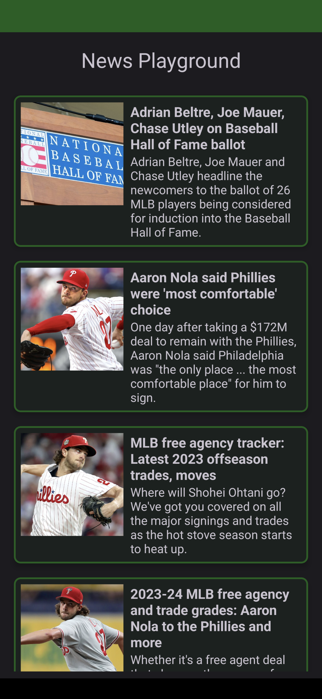

# 🌟 MLB News Aggregator App Take-Home Project

## 📚 Introduction

Welcome to the MLB News Aggregator App take-home project! This assignment focuses on Kotlin, Material Design, and modern Android development practices.

## 📱 About the App

The MLB News Aggregator App is a mobile application that currently aggregates and displays 
news related to Major League Baseball. It fetches news articles from various sources 
and presents them in a list format. When clicked, each item in the list opens a chrome tab related
to the article. The app is built using older Android development practices and needs modernization.

## 🎯 Objective

Refactor and enhance a pre-built Android app that aggregates MLB news.

## ✅ Tasks

- **Modularize the Project**: Refactor the app into a modular architecture.
- **Modernize the Project**: Implement modern practices where you feel necessary.
- **Update the project so it functions offline**: Add caching. When offline and the user clicks on an article, display a snackbar or toast indicating there is no internet connection.
- **UI**: Update the UI to your liking. As long as the basic functionality is there, feel free to add your own flair.
- **Add tests**: Add unit or UI tests. You can use any testing framework you like. Don't worry about 100% coverage, just show us how you would test the app. 

## 📊 Evaluation Criteria

- 🛠️ **Modernization and Best Practices**: Usage of modern development practices and patterns.
- 🔍 **Functionality**: App functionality and performance.
- 💻 **Code Quality**: Cleanliness and documentation of the code.

## 📝 Submission

Submit by [Submission Date]. Please commit all changes to a Git repository and provide the link for review.

## 📷 Screenshots

